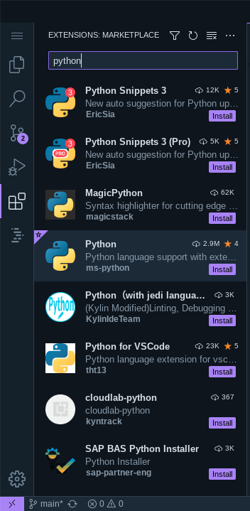

[](https://classroom.github.com/a/vbnbTt5m)
[](https://classroom.github.com/online_ide?assignment_repo_id=15251851&assignment_repo_type=AssignmentRepo)
# Dev_Setup
Setup Development Environment

#Assignment: Setting Up Your Developer Environment

#Objective:
This assignment aims to familiarize you with the tools and configurations necessary to set up an efficient developer environment for software engineering projects. Completing this assignment will give you the skills required to set up a robust and productive workspace conducive to coding, debugging, version control, and collaboration.

#Tasks:

1. Select Your Operating System (OS):
   - My operating System is chromeOS Flex I use a debian virtual terminal .

2. Install a Text Editor or Integrated Development Environment (IDE):
   - IDE: Visual Studio Code.
   - Installaion process:```
      - sudo apt install apt-transport-https
      - sudo apt update
      - sudo apt install software-properties-common apt-transport-https wget
      - wget -q https://packages.microsoft.com/keys/microsoft.asc -O- | sudo apt-key add -
      - sudo add-apt-repository "deb [arch=amd64] https://packages.microsoft.com/repos/vscode stable main"
      - sudo apt update
      - sudo apt install code```

3. Set Up Version Control System:
   - Install Git and configure it on your local machine. Create a GitHub account for hosting your repositories. Initialize a Git repository for your project and make your first commit. https://github.com
   
   -git install & Authentication:
      - open terminal and type:```
         - sudo apt update
         - sudo apt install git```

      To authenticate Git push with GitHub using a token, you can follow these steps:

         Step 1: Generate a Personal Access Token
            1. Open your GitHub account settings by clicking on your profile picture in the top right corner and selecting “Settings” from the dropdown menu.
            2. In the left sidebar, click on “Developer settings” and then select “Personal access tokens”.
            3. Click on the “Generate new token” button.
            4. Give your token a descriptive name in the “Note” field to easily identify it later.
            5. Select the desired scopes for your token. For Git operations, you need to select the “repo” scope.
            6. Click on the “Generate token” button at the bottom of the page.
            7. GitHub will generate a new personal access token for you. Make sure to copy this token and keep it in a safe place. Note that this token will only be displayed once, so make sure to copy it before leaving the page.

         Step 2: Configure Git to Use the Token
            1. Open a terminal or command prompt.
            2. Set the token as a credential helper for Git by running the following command, replacing <TOKEN> with the token you generated in step 1:
            ```git config --global credential.helper '!f() { sleep 1; echo "username=git token=<TOKEN>"; }; f'```
            This command sets up a temporary credential helper that uses the provided token for authentication.

         Step 3: Test the Authentication
            1. Navigate to a local Git repository where you want to test the authentication.
            2. Make a small change to a file in the repository.
            3. Commit the change using the following command: 
               ```git commit -am "Test commit"```
            4. Push the commit to GitHub using the following command: git push
            
            If the authentication is successful, Git should push the commit to the remote repository without asking for your GitHub username and password.

4. Install Necessary Programming Languages and Runtimes:
  Instal Python from http://wwww.python.org programming language required for your project and install their respective compilers, interpreters, or runtimes. Ensure you have the necessary tools to build and execute your code.
   1. open terminal
   2. check if python is installed by typing the following command:
      ```python3```
   3. if not installed type the following command:
      ```sudo apt install python3```

5. Install Package Managers:
   If applicable, install package managers like pip (Python).

   1. open terminal
   2. check if pip is installed by typing the following command:
      ```pip```
   3. if not installed type the following command:
      ```sudo apt install python3-pip```

6. Configure a Database (MySQL):
   Download and install MySQL database. https://dev.mysql.com/downloads/windows/installer/5.7.html

   1. open terminal
   2. check if mysql is installed by typing the following command:
      ```mysql```
   3. if not installed type the following command:
      ```sudo apt install mysql-server```

7. Set Up Development Environments and Virtualization (Optional):
   Consider using virtualization tools like Docker or virtual machines to isolate project dependencies and ensure consistent environments across different machines.

   1. open terminal
   2. check if docker is installed by typing the following command:
      ```docker```
   3. if not installed type the following command:
      ```sudo apt install docker.io```

8. Explore Extensions and Plugins:
   Explore available extensions, plugins, and add-ons for your chosen text editor or IDE to enhance functionality, such as syntax highlighting, linting, code formatting, and version control integration.

   1. open vs-code.
   2. '''ctrl + shift + x``` 
   
   3. Search and install the following plugins:
      - Python by ms-python
      - flutter by Dart-Code
      - prettier by esbenp
      - eslint by eslint
      - git by git-for-vscode

9. Document Your Setup:
    Create a comprehensive document outlining the steps you've taken to set up your developer environment. Include any configurations, customizations, or troubleshooting steps encountered during the process. 

   1. Operating System:
      -Ubuntu
   2. IDE: 
      -Visual Studio Code
      command line:
         sudo apt update
         sudo apt install code
   3. Version Control System:
      -Git
      command line:
         git install
   4. Programming Language:
      -Python
      command line:
         sudo apt install python3
   5. Package Manager:
      -pip
      command line:
         sudo apt install python3-pip
   6. Database:
      -MySQL
      command line:
         sudo apt install mysql-server
   7. Development Environment:
      -Docker
      command line:
         sudo apt install docker.io
   8. Extensions and Plugins inside vs-code:
      -open vs-code.
      -ctrl + shift + x
      -Search and install the following plugins:
         - Python by ms-python
         - flutter by Dart-Code
         - prettier by esbenp
         - eslint by eslint
         - git by git-for-vscode

#Deliverables:
- Document detailing the setup process with step-by-step instructions and screenshots where necessary.
- A GitHub repository containing a sample project initialized with Git and any necessary configuration files (e.g., .gitignore).
- A reflection on the challenges faced during setup and strategies employed to overcome them.

#Submission:
Submit your document and GitHub repository link through the designated platform or email to the instructor by the specified deadline.

#Evaluation Criteria:**
- Completeness and accuracy of setup documentation.
- Effectiveness of version control implementation.
- Appropriateness of tools selected for the project requirements.
- Clarity of reflection on challenges and solutions encountered.
- Adherence to submission guidelines and deadlines.

Note: Feel free to reach out for clarification or assistance with any aspect of the assignment.
